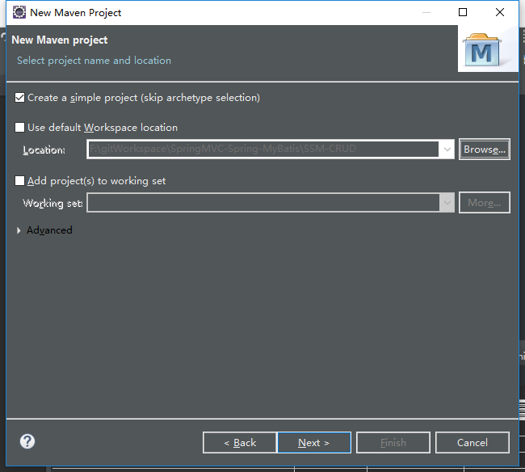
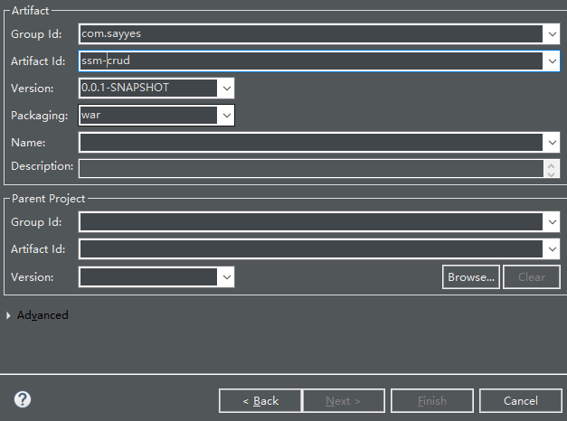
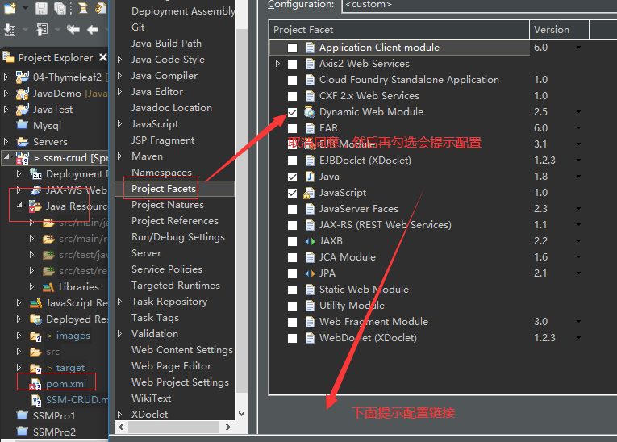
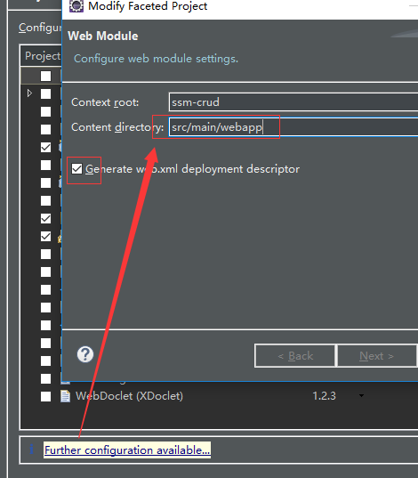

## SSM-CRUD案例

### 1、创建maven工程（这里是eclipse创建）

#### 1）使用简单模板



#### 2）war包创建



#### 3）工程"报错"，自动生成web.xml

#### 4）配置位置



#### 5）配置路径src/main/webapp



### 2、引入项目依赖

Maven仓库：https://mvnrepository.com/

- Spring
- SpringMVC
- MyBatis
- MySQL
- 其他包（jstl、servlet-api、junit）

```xml
<!-- 依赖包 -->
<dependencies>
    <!-- spring相关包 -->
    <dependency>
        <groupId>org.springframework</groupId>
        <artifactId>spring-webmvc</artifactId>
        <version>5.1.14.RELEASE</version>
    </dependency>
    <dependency>
        <groupId>org.springframework</groupId>
        <artifactId>spring-jdbc</artifactId>
        <version>5.1.14.RELEASE</version>
    </dependency>
    <dependency>
        <groupId>org.springframework</groupId>
        <artifactId>spring-aspects</artifactId>
        <version>5.1.14.RELEASE</version>
    </dependency>
    <!-- mybatis持久层框架 -->
    <dependency>
        <groupId>org.mybatis</groupId>
        <artifactId>mybatis</artifactId>
        <version>3.4.6</version>
    </dependency>
    <!-- mysql与spring整合包 -->
    <dependency>
        <groupId>org.mybatis</groupId>
        <artifactId>mybatis-spring</artifactId>
        <version>1.3.3</version>
    </dependency>
    <!-- c3p0连接池、mysql驱动 -->
    <dependency>
        <groupId>com.mchange</groupId>
        <artifactId>c3p0</artifactId>
        <version>0.9.5.2</version>
        <type>jar</type>
        <scope>compile</scope>
    </dependency>
    <dependency>
        <groupId>mysql</groupId>
        <artifactId>mysql-connector-java</artifactId>
        <version>6.0.6</version>
    </dependency>
    <!-- jstl、servlet-api、junit -->
    <dependency>
        <groupId>javax.servlet</groupId>
        <artifactId>jstl</artifactId>
        <version>1.2</version>
    </dependency>
    <dependency>
        <groupId>javax.servlet</groupId>
        <artifactId>servlet-api</artifactId>
        <version>2.5</version>
        <scope>provided</scope><!-- 不发布 -->
    </dependency>
    <dependency>
        <groupId>junit</groupId>
        <artifactId>junit</artifactId>
        <version>4.12</version>
        <!-- <scope>test</scope> -->
    </dependency>
</dependencies>
```

### 3、引入前端框架bootstrap快速搭建前端页面

#### 1）官网下载

#### 2）在src/main/webapp下新增static目录村妇

#### 3）新建index.jsp引入框架

### 4、编写配置文件

#### 1）web.xml

```xml
<?xml version="1.0" encoding="UTF-8"?>
<web-app xmlns="http://xmlns.jcp.org/xml/ns/javaee"
         xmlns:xsi="http://www.w3.org/2001/XMLSchema-instance"
         xsi:schemaLocation="http://xmlns.jcp.org/xml/ns/javaee http://xmlns.jcp.org/xml/ns/javaee/web-app_4_0.xsd"
         version="4.0">
    <!-- 1、启动Spring的容器 -->
    <!-- ContentLoadListener -->
    <context-param>
        <!-- 修改加载路径 -->
        <param-name>contextConfigLocation</param-name>
        <param-value>classpath:applicationContext.xml</param-value>
    </context-param>
    <listener>
        <!-- 默认加载WEB-INF下面配置 -->
        <listener-class>org.springframework.web.context.ContextLoaderListener</listener-class>
    </listener>

    <!--2、SpringMVC的前端控制器，拦截所有请求-->
    <servlet>
        <servlet-name>dispatcherServlet</servlet-name>
        <servlet-class>org.springframework.web.servlet.DispatcherServlet</servlet-class>
        <!-- 这里不设置值，就需要在web.xml同级目录新增dispatcherServlet-servlet.xml-->
        <load-on-startup>1</load-on-startup>
    </servlet>
    <servlet-mapping>
        <servlet-name>dispatcherServlet</servlet-name>
        <url-pattern>/</url-pattern><!-- 拦截所有请求 -->
    </servlet-mapping>

    <!-- 3、字符编码，所有过滤器之前 -->
    <filter>
        <filter-name>CharacterEncodingFilter</filter-name>
        <filter-class>org.springframework.web.filter.CharacterEncodingFilter</filter-class>
        <init-param>
            <param-name>encoding</param-name>
            <param-value>UTF-8</param-value>
        </init-param>
        <init-param>
            <param-name>forceRequestEncoding</param-name>
            <param-value>true</param-value>
        </init-param>
        <init-param>
            <param-name>forceResponseEncoding</param-name>
            <param-value>true</param-value>
        </init-param>
    </filter>
    <filter-mapping>
        <filter-name>CharacterEncodingFilter</filter-name>
        <url-pattern>/*</url-pattern>
    </filter-mapping>

    <!-- 4、rest风格uri，将页面普通的post请求转换为指定的delete或put请求 -->
    <filter>
        <filter-name>HiddenHttpMethodFilter</filter-name>
        <filter-class>org.springframework.web.filter.HiddenHttpMethodFilter</filter-class>
    </filter>
    <filter-mapping>
        <filter-name>HiddenHttpMethodFilter</filter-name>
        <url-pattern>/*</url-pattern>
    </filter-mapping>
</web-app>
```

#### 2）dispatcherServlet-servlet.xml

```xml
<?xml version="1.0" encoding="UTF-8"?>
<beans xmlns="http://www.springframework.org/schema/beans"
       xmlns:xsi="http://www.w3.org/2001/XMLSchema-instance"
       xmlns:context="http://www.springframework.org/schema/context"
       xmlns:mvc="http://www.springframework.org/schema/mvc"
       xsi:schemaLocation="http://www.springframework.org/schema/beans http://www.springframework.org/schema/beans/spring-beans.xsd http://www.springframework.org/schema/context https://www.springframework.org/schema/context/spring-context.xsd http://www.springframework.org/schema/mvc https://www.springframework.org/schema/mvc/spring-mvc.xsd">
    <!-- SpringMVC的配置文件，包含网站调整逻辑的控制，配置 -->
    <!-- 扫描com.sayyes.controller包下面的内容，禁用默认规则 -->
    <context:component-scan base-package="com.sayyes.controller" use-default-filters="false">
        <!--只扫描控制器-->
        <context:exclude-filter type="annotation" expression="org.springframework.stereotype.Controller"/>
    </context:component-scan>

    <!--配置试图解析器，方便页面返回-->
    <bean class="org.springframework.web.servlet.view.InternalResourceViewResolver">
        <!--页面位置-->
        <property name="prefix" value="/WEB-INF/views/"></property>
        <!--后缀-->
        <property name="suffix" value=".jsp"></property>
    </bean>

    <!--两个标准配置-->
    <!--将springmvc不能处理的请求交给tomcat-->
    <mvc:default-servlet-handler/>
    <!--能支持springmvc更高级的一些功能，如：JSR303校验，快捷的ajax... ##映射动态请求-->
    <mvc:annotation-driven/>
</beans>
```

#### 3）spring配置文件applicationContext.xml

```xml
<?xml version="1.0" encoding="UTF-8"?>
<beans xmlns="http://www.springframework.org/schema/beans"
       xmlns:xsi="http://www.w3.org/2001/XMLSchema-instance"
       xmlns:context="http://www.springframework.org/schema/context"
       xmlns:aop="http://www.springframework.org/schema/aop" xmlns:tx="http://www.springframework.org/schema/tx"
       xsi:schemaLocation="http://www.springframework.org/schema/beans http://www.springframework.org/schema/beans/spring-beans.xsd http://www.springframework.org/schema/context https://www.springframework.org/schema/context/spring-context.xsd http://www.springframework.org/schema/aop https://www.springframework.org/schema/aop/spring-aop.xsd http://www.springframework.org/schema/tx http://www.springframework.org/schema/tx/spring-tx.xsd">
    <!--不扫描控制器-->
    <context:component-scan base-package="com.sayyes">
        <context:exclude-filter type="annotation" expression="org.springframework.stereotype.Controller"/>
    </context:component-scan>

    <!--spring的配置文件，这里主要配置和业务逻辑有关的-->
    <!--数据源，事务控制...-->
    <!-- 引入外部配置文件 -->
    <context:property-placeholder location="classpath:dbconfig.properties"/>
    <!--c3p0数据源-->
    <bean id="pooledDataSource" class="com.mchange.v2.c3p0.ComboPooledDataSource">
        <!--使用配置文件读取数据-->
        <property name="jdbcUrl" value="${jdbc.jdbcUrl}"></property>
        <property name="driverClass" value="${jdbc.driverClass}"></property>
        <property name="user" value="${jdbc.user}"></property>
        <property name="password" value="${jdbc.password}"></property>
    </bean>

    <!--配置的mybatis的整合-->
    <bean id="sqlSessionFactory" class="org.mybatis.spring.SqlSessionFactoryBean">
        <!--mybatis全局配置文件-->
        <property name="configLocation" value="classpath:mybatis-config.xml"/>
        <!--数据源绑定-->
        <property name="dataSource" ref="pooledDataSource"/>
        <!--mybatis的mapper配置文件的位置-->
        <property name="mapperLocations" value="classpath:mapper/*xml"/>
    </bean>
    <!--配置扫描器，将mybatis的接口实现加入到ioc容器-->
    <bean class="org.mybatis.spring.mapper.MapperScannerConfigurer">
        <!--扫描所有dao接口-->
        <property name="basePackage" value="com.sayyes.dao"/>
    </bean>

    <!--事务控制的配置-->
    <bean id="transactionManager" class="org.springframework.jdbc.datasource.DataSourceTransactionManager">
        <!--控制数据源-->
        <property name="dataSource" ref="pooledDataSource"/>
    </bean>
    <!--开启注解的食物，使用xml配置(一般用xml)-->
    <aop:config>
        <!--切入点表达式-->
        <aop:pointcut id="txPoint" expression="execution(* com.sayyes.service..*(..))"/>
        <!--配置事物增强-->
        <aop:advisor advice-ref="txAdvice" pointcut-ref="txPoint"/>
    </aop:config>
    <!--配置事物增强，事物如何切入-->
    <tx:advice id="txAdvice" transaction-manager="transactionManager">
        <tx:attributes>
            <!--*代表所有方法都是事物方法-->
            <tx:method name="*"/>
            <!--以get开始的所有方法-->
            <tx:method name="get" read-only="true"/>
        </tx:attributes>
    </tx:advice>
    <!--spring配置文件的核心点（数据源、与mybatis的整合、事物控制）-->
</beans>
```

#### 4）mybatis配置文件：mybatis-config.xml

```xml
<?xml version="1.0" encoding="utf-8" ?>
<!DOCTYPE configuration
        PUBLIC "-//mybatis.org//DTD Config 3.0//EN"
        "http://mybatis.org/dtd/mybatis-3-config.dtd">
<configuration>

    <settings>
        <!--驼峰命名-->
        <setting name="mapUnderscoreToCamelCase" value="true"/>
    </settings>
    <typeAliases>
        <package name="com.sayyes.bean"/>
    </typeAliases>
</configuration>

```

### 5、建表

- tbl_emp员工表

```
create table tbl_emp(
    emp_id int(11) primary key auto_increment,
    emp_name varchar(255),
    gender char(1),
    email varchar(255),
    d_id int(11)
);
```

- tbl_dept部门表

```
create table tbl_dept(
    dept_id int(11) primary key auto_increment,
    dept_name varchar(255)
);
```

### 6、mybatis generator逆向工程

#### 1）maven引入mybatis generator core

```xml
<!--mybatis generator core逆向工程-->
<dependency>
    <groupId>org.mybatis.generator</groupId>
    <artifactId>mybatis-generator-core</artifactId>
    <version>1.4.0</version>
</dependency>
```

#### 2）查看官方文档Quick Start Guide

- 新增配置文件mybatis-generator.xml

```xml
<?xml version="1.0" encoding="UTF-8"?>
<!DOCTYPE generatorConfiguration
        PUBLIC "-//mybatis.org//DTD MyBatis Generator Configuration 1.0//EN"
        "http://mybatis.org/dtd/mybatis-generator-config_1_0.dtd">

<generatorConfiguration>
    <context id="DB2Tables" targetRuntime="MyBatis3">
        <!--生成文件不添加大量注释-->
        <commentGenerator>
            <property name="suppressAllComments" value="true"/>
        </commentGenerator>

        <!--配置数据库连接-->
        <jdbcConnection driverClass="com.mysql.cj.jdbc.Driver"
                        connectionURL="jdbc:mysql://localhost:3306/ssm?serverTimezone=UTC"
                        userId="root"
                        password="root">
        </jdbcConnection>

        <javaTypeResolver>
            <property name="forceBigDecimals" value="false"/>
        </javaTypeResolver>

        <!--指定javaBean生成的位置-->
        <javaModelGenerator targetPackage="com.sayyes.bean" targetProject=".\src\main\java">
            <property name="enableSubPackages" value="true"/>
            <property name="trimStrings" value="true"/>
        </javaModelGenerator>

        <!--指定sql映射文件mapper生成的位置-->
        <sqlMapGenerator targetPackage="mapper" targetProject=".\src\main\resources">
            <property name="enableSubPackages" value="true"/>
        </sqlMapGenerator>

        <!--指定dao接口生成的位置，mapper接口-->
        <javaClientGenerator type="XMLMAPPER" targetPackage="com.sayyes.dao" targetProject=".\src\main\java">
            <property name="enableSubPackages" value="true"/>
        </javaClientGenerator>

        <!--指定每个表的生成策略-->
        <!--表名：生成的javaBean类-->
        <table tableName="tbl_emp" domainObjectName="Employee"></table>
        <table tableName="tbl_dept" domainObjectName="Department"></table>
    </context>
</generatorConfiguration>
```

#### 3）编写类去执行生成，如MybatisGeneratorTest.java

```java
package com.sayyes.test;

import org.mybatis.generator.api.MyBatisGenerator;
import org.mybatis.generator.config.Configuration;
import org.mybatis.generator.config.xml.ConfigurationParser;
import org.mybatis.generator.internal.DefaultShellCallback;

import java.io.File;
import java.util.ArrayList;
import java.util.List;

/**
 * @author sayyes
 * @date 2020/4/20
 */
public class MybatisGeneratorTest {
    public static void main(String[] args) throws Exception {
        List<String> warnings = new ArrayList<String>();
        boolean overwrite = true;
        File configFile = new File("mybatis-generator.xml");
        ConfigurationParser cp = new ConfigurationParser(warnings);
        Configuration config = cp.parseConfiguration(configFile);
        DefaultShellCallback callback = new DefaultShellCallback(overwrite);
        MyBatisGenerator myBatisGenerator = new MyBatisGenerator(config, callback, warnings);
        myBatisGenerator.generate(null);
    }
}

```

#### 4）、根据需要调整逆向工程生成内容，比如联合查询，员工信息查询要查询部门信息

这里调整员工的xml，bean类，dao类

### 7、测试Mybatis与数据库是否连通

#### 1）新增测试类

```java
package com.sayyes.test;

import com.sayyes.bean.Department;
import com.sayyes.bean.Employee;
import com.sayyes.dao.DepartmentMapper;
import com.sayyes.dao.EmployeeMapper;
import org.apache.ibatis.session.SqlSession;
import org.junit.Test;
import org.junit.runner.RunWith;
import org.springframework.beans.factory.annotation.Autowired;
import org.springframework.test.context.ContextConfiguration;
import org.springframework.test.context.junit4.SpringJUnit4ClassRunner;

/**
 * 测试dao层
 *
 * @author sayyes
 * @date 2020/4/22
 */
@RunWith(SpringJUnit4ClassRunner.class)
@ContextConfiguration(locations = {"classpath:applicationContext.xml"})
public class MybatisTest {
    @Autowired
    DepartmentMapper departmentMapper;

    @Autowired
    EmployeeMapper employeeMapper;

    @Autowired
    SqlSession sqlSession;
    @Test
    public void test() {
        //传统方式：创建spring的ioc容器->获取mapper
//        ApplicationContext ac = new ClassPathXmlApplicationContext("applicationContext.xml");
//        DepartmentMapper bean = ac.getBean(DepartmentMapper.class);
//        System.out.println(bean);//可以输出对象

        /*
            spring单元测试方式
            1、Maven引入SpringTest模块：添加注解
                @RunWith(SpringJUnit4ClassRunner.class)
                @ContextConfiguration(locations = {"classpath:applicationContext.xml"})
            2、然后就可以Autowired
         */
        //1、部门表测试
//        departmentMapper.insertSelective(new Department(null,"开发部"));
//        departmentMapper.insertSelective(new Department(null,"测试部"));

        //2、员工表测试
//        employeeMapper.insertSelective(new Employee(null, "张三", "M", "zhangsan@qq.com", 1));
//        employeeMapper.insertSelective(new Employee(null, "李四", "M", "lisi@qq.com", 2));
        //批量插入使用sqlsession
        EmployeeMapper mapper = sqlSession.getMapper(EmployeeMapper.class);
        for (int i=0;i<10;i++){
            mapper.insertSelective(new Employee(null, "z"+i, "F", "z"+i+"@qq.com", 2));
        }
    }
}

```

#### 2）额外调整

- maven引入SpringTest模块

- Spring里面添加批量sqlSession处理
- 对于员工bean类和部门bean类添加有参无参构造方法

### 8、业务模块开发

